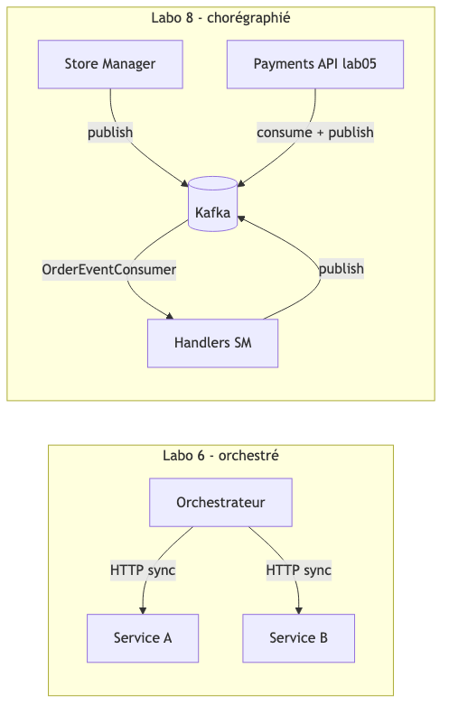
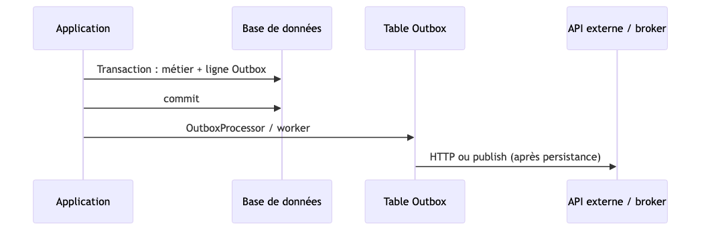
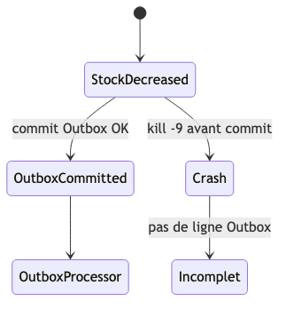
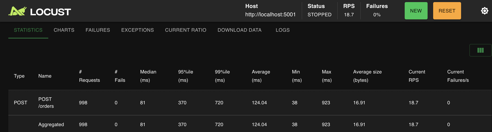
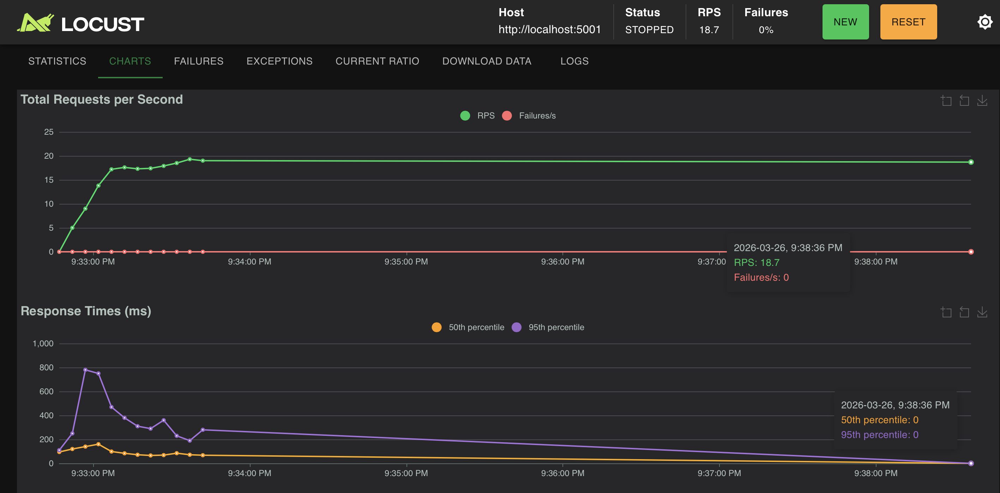
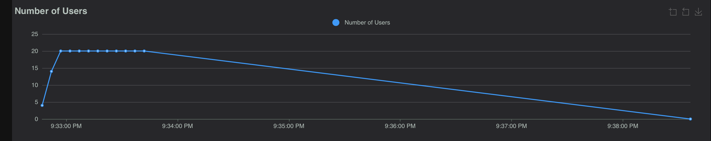

<div align="center">

<h3 style="text-align:center; font-size:14pt;">
ÉCOLE DE TECHNOLOGIE SUPÉRIEURE<br>
UNIVERSITÉ DU QUÉBEC
</h3>

<br><br>

<h3 style="text-align:center; font-size:15pt;">
RAPPORT DE LABORATOIRE <br> 
PRÉSENTÉ À <br> 
M. FABIO PETRILLO <br> 
DANS LE CADRE DU COURS <br>
<em>ARCHITECTURE LOGICIELLE</em> (LOG430-01)
</h3>

<br><br>

<h3 style="text-align:center; font-size:15pt;">
Laboratoire 8 — Saga chorégraphiée, CQRS avec event broker, patron Outbox
</h3>

<br><br>

<h3 style="text-align:center; font-size:15pt;">
PAR
<br>
Ashley Lester Ian GUEVARRA, GUEA70370101
</h3>

<br><br>

<h3 style="text-align:center; font-size:15pt;">
MONTRÉAL, LE 26 MARS 2026
</h3>

<br><br>

</div>

<div style="page-break-before: always;"></div>

### Tables des matières 
- [Question 1](#question-1)
- [Question 2](#question-2)
- [Question 3](#question-3)
- [Question 4](#question-4)
- [Question 5](#question-5)

<div style="page-break-before: always;"></div>

<div style="text-align: justify;">

#### Question 1

> Comment on faisait pour passer d'un état à l'autre dans la saga dans le labo 6, et comment on le fait ici ? Est-ce que le contrôle de transition est fait par la même structure dans le code ? Illustrez votre réponse avec des captures d'écran ou extraits de code.

**Labo 6** : l’entrée est `POST /saga/order` sur `saga_orchestrator.py`, qui délègue à `OrderSagaController.run()` (dépôt du labo 6, `controllers/order_saga_controller.py`). Une boucle `while` lit `self.current_saga_state` (`OrderSagaState`) et enchaîne des handlers synchrones (`CreateOrderHandler`, `DecreaseStockHandler`, `CreatePaymentHandler`, etc.) : chaque `handler.run()` retourne le **prochain état** de la machine. Les appels aux microservices passent par **HTTP** vers la passerelle, par ex. `requests.post(..., f'{config.API_GATEWAY_URL}/store-manager-api/orders', ...)` dans `handlers/create_order_handler.py`. Les compensations (ex. `STOCK_INCREASED` → `DeleteOrderHandler`) sont aussi dans cette même boucle.

Extrait — machine à états + enchaînement (labo 6, `order_saga_controller.py`) :

```python
while self.current_saga_state is not OrderSagaState.END:
    if self.current_saga_state == OrderSagaState.START:
        self.current_saga_state = self.create_order_handler.run()
    elif self.current_saga_state == OrderSagaState.ORDER_CREATED:
        self.decrease_stock_handler = DecreaseStockHandler(...)
        self.current_saga_state = self.decrease_stock_handler.run()
    elif self.current_saga_state == OrderSagaState.STOCK_DECREASED:
        self.create_payment_handler = CreatePaymentHandler(...)
        self.current_saga_state = self.create_payment_handler.run()
    # ... autres états / compensation ...
```

**Labo 8** : pas d’orchestrateur. Chaque composant réagit aux messages Kafka : on fait avancer la saga en changeant `event_data['event']` et en republiant le même payload sur le topic. Côté Store Manager, c’est un `HandlerRegistry` + des `EventHandler` branchés sur `OrderEventConsumer` (`store_manager.py`). Le Payments API a son propre consommateur (`PaymentEventConsumer` dans le labo 5) sur le même topic, ce que le schéma ci-dessous résume.

**Structure** (différente du labo 6) :

- `HandlerRegistry` / `EventHandler` : `get_event_type()` et `handle(event_data)`
- `OrderEventProducer` pour publier
- `OrderEventConsumer` : routage selon `event_data['event']`

Extrait — enregistrement des handlers et démarrage du consommateur (`store_manager.py`) :

```python
registry = HandlerRegistry()
registry.register(OrderCreatedHandler())
registry.register(StockDecreasedHandler())
# ... autres handlers ...
consumer_service = OrderEventConsumer(
    bootstrap_servers=config.KAFKA_HOST,
    topic=config.KAFKA_TOPIC,
    group_id=config.KAFKA_GROUP_ID,
    registry=registry
)
consumer_service.start()
```

Extrait — **transition** après traitement local (`OrderCreatedHandler`) : on **change le nom de l’événement** puis on republie sur Kafka.

```python
event_data['event'] = "StockDecreased"  # ou StockDecreaseFailed en cas d'erreur
order_event_producer.get_instance().send(config.KAFKA_TOPIC, value=event_data)
```

Le fichier `docs/views/state_machine.puml` du dépôt décrit les mêmes transitions que dans l’énoncé : chemin nominal `OrderCreated` → `StockDecreased` → `PaymentCreated` → `SagaCompleted`, avec branches de compensation (`StockDecreaseFailed`, `PaymentCreationFailed` + `StockIncreased` + `OrderCancelled`, etc.). Le schéma suivant ne remplace pas ce PUML : il compare seulement l’idée labo 6 vs labo 8. *(Les exports PDF affichent souvent le code Mermaid brut ; ici le rendu est en PNG. Source : `docs/mermaid-source/q1-lab6-lab8.mmd`.)*



*Figure Q1-a — Kafka et handlers vs orchestrateur HTTP.*

*Précision : ce schéma met l’accent sur Kafka. En labo 8, la création du paiement côté Store Manager passe aussi par un appel **HTTP** synchrone (`OutboxProcessor` → KrakenD → Payments), en parallèle de la chorégraphie par événements.*

**Logs** (`docker logs store_manager`, après `POST /orders` sur le port mappé, ex. 5001) : la séquence attendue pour un scénario qui va au bout ressemble à celle de l’énoncé : `OrderCreated` → `StockDecreased` → activité `OutboxProcessor` (appel HTTP vers la passerelle puis mise à jour) → `PaymentCreated` → `SagaCompleted`. Il peut y avoir **15–30 s** de délai selon Kafka et les services.

*(Ancienne capture : si la passerelle ou le service payments renvoie une erreur HTTP / corps non JSON, `OutboxProcessor` logue une erreur du type `Expecting value` et publie `PaymentCreationFailed` ; avec la stack compose à jour — `payments-api`, KrakenD sur `payments-api:5009` — cet appel réussit et la suite d’événements redevient cohérente.)*

Commande utilisée :

```bash
curl -s -X POST http://localhost:5001/orders \
  -H "Content-Type: application/json" \
  -d '{"user_id":1,"items":[{"product_id":2,"quantity":1},{"product_id":3,"quantity":2}]}'
```

Exemple de lignes typiques (ordre réel peut varier un peu selon le polling Kafka) :

```text
... POST /orders ... 201 ...
... OrderConsumer - DEBUG - Evenement : OrderCreated
... Handler - DEBUG - payment_link=no-link
... OrderConsumer - DEBUG - Evenement : StockDecreased
... OutboxProcessor - DEBUG - Start run
... OutboxProcessor - DEBUG - item informed
... OrderConsumer - DEBUG - Evenement : PaymentCreated
... Handler - DEBUG - payment_link=http://api-gateway:8080/payments-api/payments/process/...
... OrderConsumer - DEBUG - Evenement : SagaCompleted
... Handler - INFO - Saga terminée avec succès ! ...
```

*Figure 1 — Extrait de logs (terminal ou Docker Desktop). Capture optionnelle : `Images/Lab8_Q1_Docker_logs_saga.png`.*

</div>

<br>

<div style="page-break-before: always;"></div>

<div style="text-align: justify;">

##### Question 2

> Sur la relation entre nos Handlers et le patron CQRS : pensez-vous qu'ils utilisent plus souvent les Commands ou les Queries ? Est-ce qu'on tient l'état des Queries à jour par rapport aux changements d'état causés par les Commands ? Illustrez avec des captures d'écran ou extraits de code.

Les handlers de saga passent presque tout leur temps dans des **écritures** : stock (`check_out_items_from_stock`, `update_stock_redis`), ligne Outbox, HTTP vers Payments dans `OutboxProcessor`, puis `modify_order` / `sync_order_payment_link_redis`. C’est le côté commandes (`commands/`, `write_*`).

Les **queries** REST, par exemple `GET /orders/<id>`, vivent plutôt dans `orders/queries/read_order.py` et lisent surtout **Redis**. Les handlers n’appellent pas cette query : ils **écrivent** MySQL/Redis pour que la lecture suivante soit à jour.

Oui : quand le flux paiement réussit, `sync_order_payment_link_redis` met à jour la clé `order:{id}` dans Redis, donc la réponse JSON du GET reflète le `payment_link` et `is_paid` après les commandes de la saga.

Extrait — `OrderCreatedHandler` (commandes stock + publication d’événement) :

```python
check_out_items_from_stock(session, event_data['order_items'])
session.commit()
update_stock_redis(event_data['order_items'], '-')
```

Extrait — `PaymentCreatedHandler` (synchronisation côté « vue » pour les lectures) :

```python
sync_order_payment_link_redis(event_data['order_id'], payment_link, is_paid=True)
event_data['event'] = "SagaCompleted"
OrderEventProducer().get_instance().send(config.KAFKA_TOPIC, value=event_data)
```

**Illustration — query `GET /orders/<order_id>` après la saga**

1. Créer une commande (comme en Q1), noter le `order_id` dans la réponse JSON.
2. Attendre **~10–15 s** que les handlers aient terminé (`PaymentCreated` / `SagaCompleted` dans les logs).
3. Lire la commande via l’API (**modèle de lecture** : `get_order_by_id` dans `orders/queries/read_order.py`, données dans Redis).

Commande :

```bash
curl -s http://localhost:5001/orders/5 | python3 -m json.tool
```

*(Utiliser le même numéro que l’`order_id` renvoyé par `POST /orders` — ici `5`.)*

Réponse observée (les valeurs viennent de Redis ; plusieurs champs sont des chaînes) :

```json
{
    "is_paid": "True",
    "items": "[{\"product_id\": 2, \"quantity\": 1}, {\"product_id\": 3, \"quantity\": 2}]",
    "payment_link": "http://api-gateway:8080/payments-api/payments/process/8",
    "total_amount": "71.0",
    "user_id": "1"
}
```

On voit bien un `payment_link` en `http://...` et `is_paid` à jour : la vue Redis suit ce que la saga a écrit via l’outbox et les handlers.

*Figure 2 — JSON ci-dessus ; optionnel : `Images/Lab8_Q2_GET_order_payment_link.png` (Postman).*

</div>

<br>

<div style="page-break-before: always;"></div>

<div style="text-align: justify;">

##### Question 3

> Est-ce qu'une architecture Saga orchestrée pourrait aussi bénéficier de l'utilisation du patron Outbox, ou c'est un bénéfice exclusif de la saga chorégraphiée ? Justifiez votre réponse avec un diagramme ou en faisant des références aux classes, modules et méthodes dans le code.

Non, ce n’est pas réservé à la chorégraphie. L’Outbox sert à **persister l’intention** (ex. « créer le paiement ») dans la même logique que la base locale, **avant** l’appel HTTP ou le message vers l’extérieur. Après un crash, on peut relire la table et reprendre. Ce besoin existe dès qu’on sépare état local et appel distant.

Dans le **labo 8**, `StockDecreasedHandler` (`src/stocks/handlers/stock_decreased_handler.py`) fait `session.add(Outbox(...))`, `commit`, puis `OutboxProcessor().run(new_outbox_item)`. Au boot, `store_manager.py` appelle `OutboxProcessor().run()` sans argument pour traiter les lignes encore sans `payment_id` (`outbox_processor.py`).

Dans une **saga orchestrée**, l’orchestrateur pourrait écrire la même idée dans une table outbox avant d’exécuter l’HTTP ; le composant qui « draine » la table serait différent, pas le principe.



*Figure 3 — Persistance outbox puis appel externe. Source : `docs/mermaid-source/q3-outbox.mmd`.*

Code utile : `payments.models.outbox.Outbox`, `OutboxProcessor.run`, `_process_outbox_item`, `_request_payment_transaction` (POST vers `http://api-gateway:8080/payments-api/payments`).

</div>

<br>

<div style="page-break-before: always;"></div>

<div style="text-align: justify;">

##### Question 4

> Qu'est-ce qui arriverait si notre application s'arrête avant la création de l'enregistrement dans la table Outbox ? Comment on pourrait améliorer notre implémentation pour résoudre ce problème ? Justifiez avec un diagramme ou des références aux classes, modules et méthodes.

Si le processus meurt après la baisse de stock (message `StockDecreased` déjà consommé / stock MySQL déjà mis à jour dans `OrderCreatedHandler`) mais avant qu’une ligne Outbox ne soit **commit**, on peut avoir du stock en moins sans ligne `outbox` et sans paiement. Au redémarrage, `OutboxProcessor().run()` ne voit rien à traiter pour cette commande : pas de reprise automatique, état sale possible (`payment_link` vide alors que le stock a bougé). *(Le cas le plus étroit est un crash entre `flush` et `commit` dans `StockDecreasedHandler` ; le cas plus large est une incohérence si on sépare stock et outbox dans des transactions différentes.)*

Pistes possibles :

1. Tenir **stock + outbox** dans une seule transaction locale quand c’est faisable, ou un journal d’étapes saga commité avant effets irréversibles.
2. Job de **réconciliation** : commandes payantes attendues sans outbox / sans lien, republication ou compensation.
3. **Idempotence** côté Payments sur `order_id` si on retente.

Fichiers : `StockDecreasedHandler.handle`, `payments.models.outbox.Outbox`, `OutboxProcessor.run`.



*Figure 4 — Crash possible avant que l’outbox soit durable. Source : `docs/mermaid-source/q4-crash.mmd`.*

</div>

<br>

<div style="page-break-before: always;"></div>

<div style="text-align: justify;">

##### Question 5

> Exécutez un test de charge sur l'application Store Manager (Locust). Testez la création d'une commande et notez vos observations sur les performances (voir laboratoire 4, activité 5).

Scénario : charge sur **`POST /orders`** avec le JSON ci-dessous (identique à `locustfile_orders.py` à la racine du dépôt lab08).

```json
{
  "user_id": 1,
  "items": [
    { "product_id": 2, "quantity": 1 },
    { "product_id": 3, "quantity": 2 }
  ]
}
```

Prérequis : `docker compose up` (Store Manager joignable, ex. `http://localhost:5001` si le port est mappé ainsi).

```bash
python3 -m pip install locust
cd /chemin/vers/ashleyguevarra_lab08
python3 -m locust -f locustfile_orders.py --host http://localhost:5001
```

UI Locust : `http://localhost:8089`. Si le port 8089 est pris, par exemple :

```bash
python3 -m locust -f locustfile_orders.py --host http://localhost:5001 --web-port 8090
```

Montée progressive raisonnable : ~20–50 utilisateurs, 2–5/s, 1–2 min (ou arrêt manuel). Noter médiane, p95, RPS, échecs.

À garder en tête : le **201** sur `POST /orders` revient avant la fin de la saga Kafka ; Locust mesure surtout création commande + publish, pas `SagaCompleted`. Sous forte charge, MySQL / Redis / Kafka peuvent faire monter les latences ou des 500. Option : `docker stats` pendant le run.

**Résultats** (run local, `--host http://localhost:5001`, tâche `POST /orders` du locustfile) :

| Indicateur | Valeur |
|------------|--------|
| Nombre de requêtes | 998 |
| Échecs (failures) | 0 |
| Médiane (ms) | 81 |
| 95e percentile (ms) | 370 |
| Requêtes/s (approx.) | 18.7 |

Sur cet essai : pas d’échec HTTP. Débit autour de **19 req/s**. Médiane **81 ms**, mais p95 **370 ms** et p99 ~**720 ms** (UI Locust) : une partie des requêtes attend plus (file d’attente côté DB, Redis, broker, CPU). Les graphiques Charts montrent un pic au ramp-up puis une zone plus plate ; le graphe « users » suit la montée à **20** utilisateurs puis la descente.



*Figure 5a — Statistiques agrégées (POST /orders).*



*Figure 5b — Débit et percentiles dans le temps.*



*Figure 5c — Montée du nombre d’utilisateurs (pic à 20).*

Si l’API passe par KrakenD seulement, ajuster `--host` et le chemin dans `locustfile_orders.py` (ex. préfixe gateway).

</div>

</div> 

<br>
