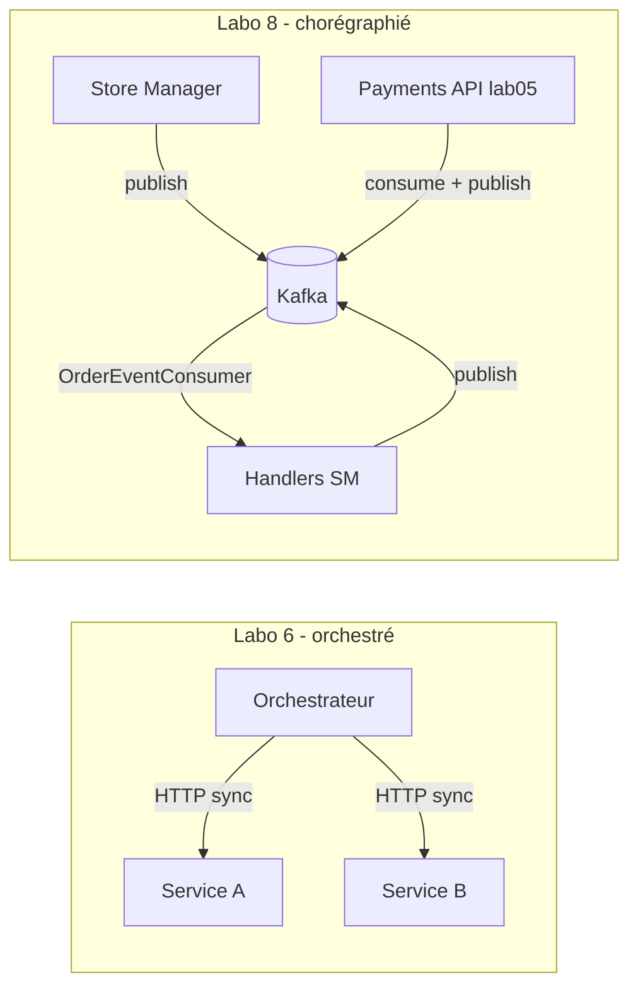
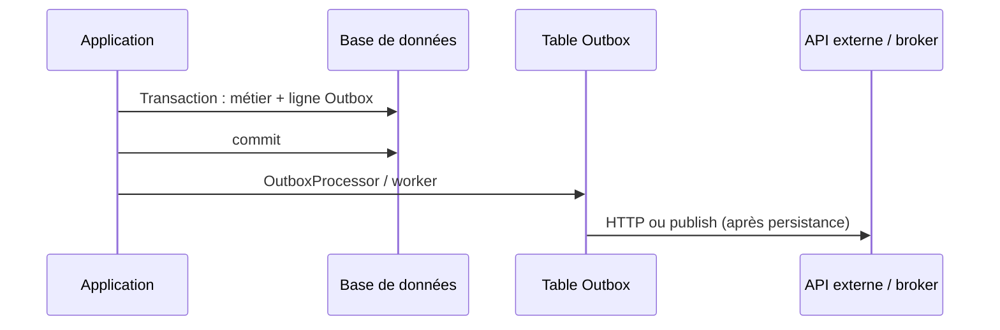
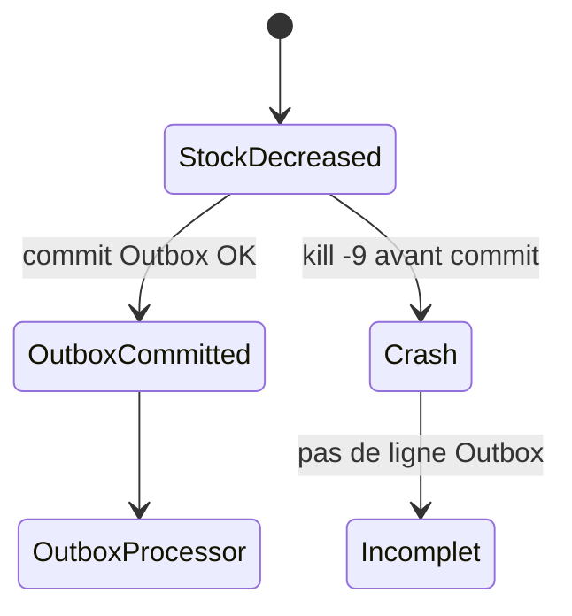

# Trace — diagrammes Mermaid (rapport Lab 8)

Sources des figures exportées en PNG pour `ashley_guevarra_lab-report.md`. Fichiers `.mmd` canoniques : `docs/mermaid-source/`.

---

## Q1 — Lab 6 vs lab 8 (`q1-lab6-lab8.mmd` → `Images/Lab8_Q1_flowchart_lab6_lab8.png`)



---

## Q3 — Outbox (`q3-outbox.mmd` → `Images/Lab8_Q3_Outbox_sequence.png`)



---

## Q4 — Fenêtre de crash (`q4-crash.mmd` → `Images/Lab8_Q4_risk_window.png`)



---

## Régénérer les PNG

```bash
cd ashleyguevarra_lab08
npx @mermaid-js/mermaid-cli -i docs/mermaid-source/q1-lab6-lab8.mmd -o Images/Lab8_Q1_flowchart_lab6_lab8.png -b white
npx @mermaid-js/mermaid-cli -i docs/mermaid-source/q3-outbox.mmd -o Images/Lab8_Q3_Outbox_sequence.png -b white
npx @mermaid-js/mermaid-cli -i docs/mermaid-source/q4-crash.mmd -o Images/Lab8_Q4_risk_window.png -b white
```
